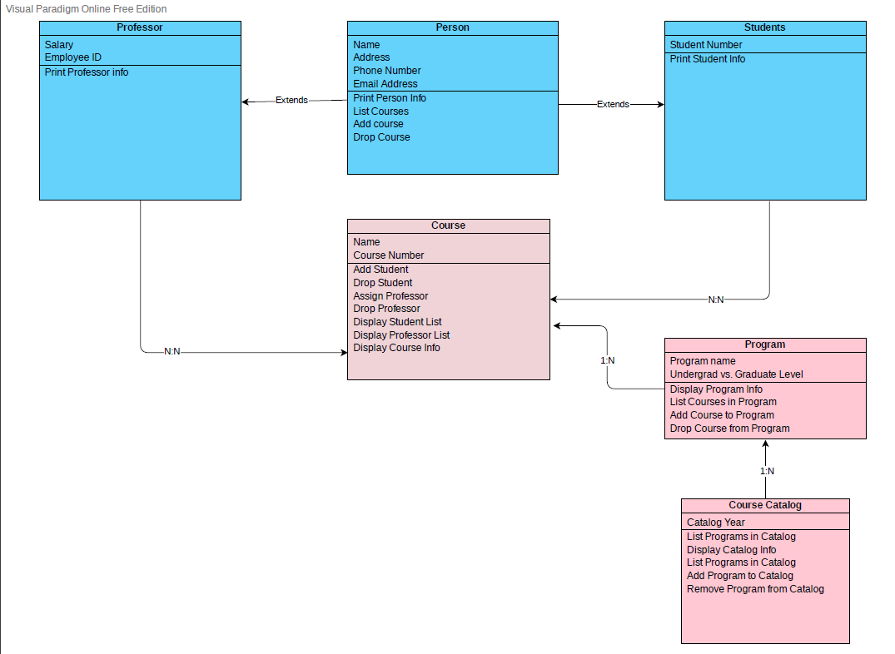

# Designing-an-Academic-Department-System-with-Classes
For this assignment, I have designed and implemented a system for an academic department within a university with UML and Python. Since this assignment was focused more on object oriented design, only a few aspects are tested in the main program to show a proof of concept for the department design. The end goal was to create a class called CourseCatalog to compute all the course offerings for a program. This will demonstrate the use of inheritance, association, and aggregation.

For overall concept design please refer to UML diagram below 

